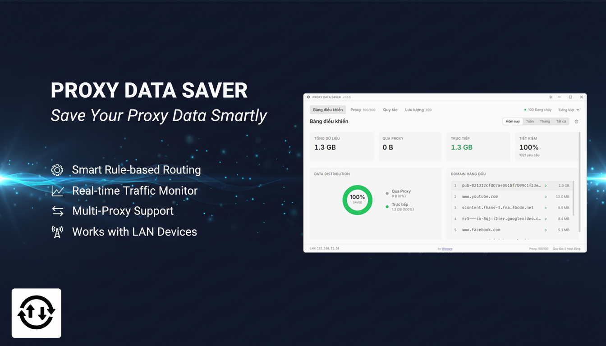
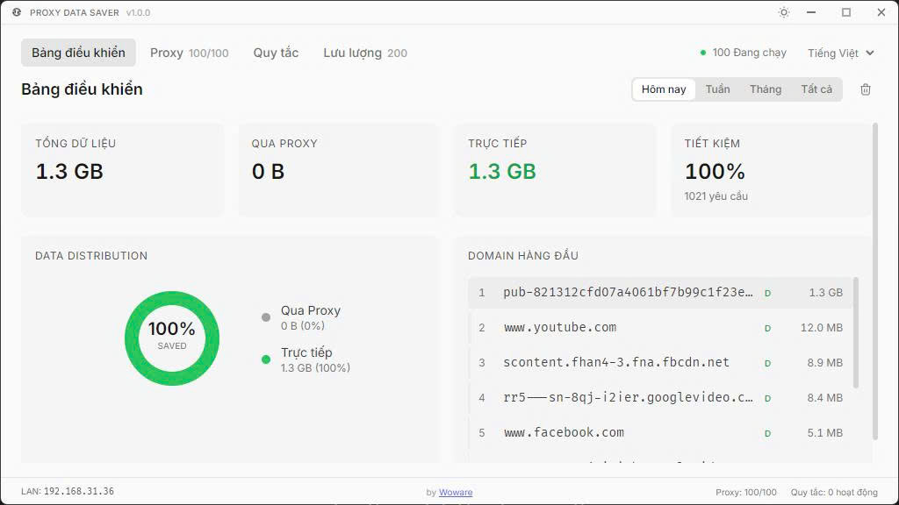
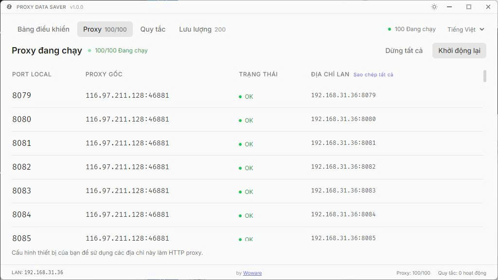
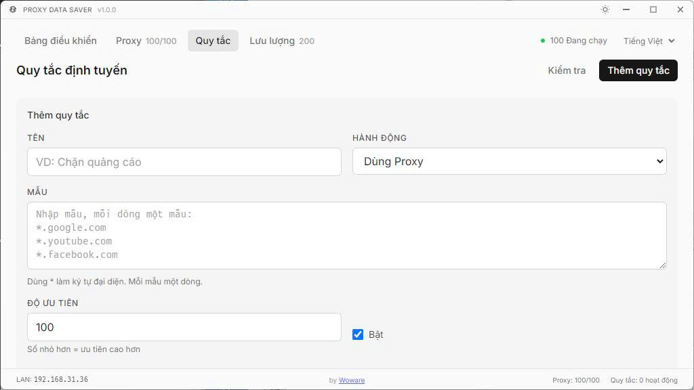
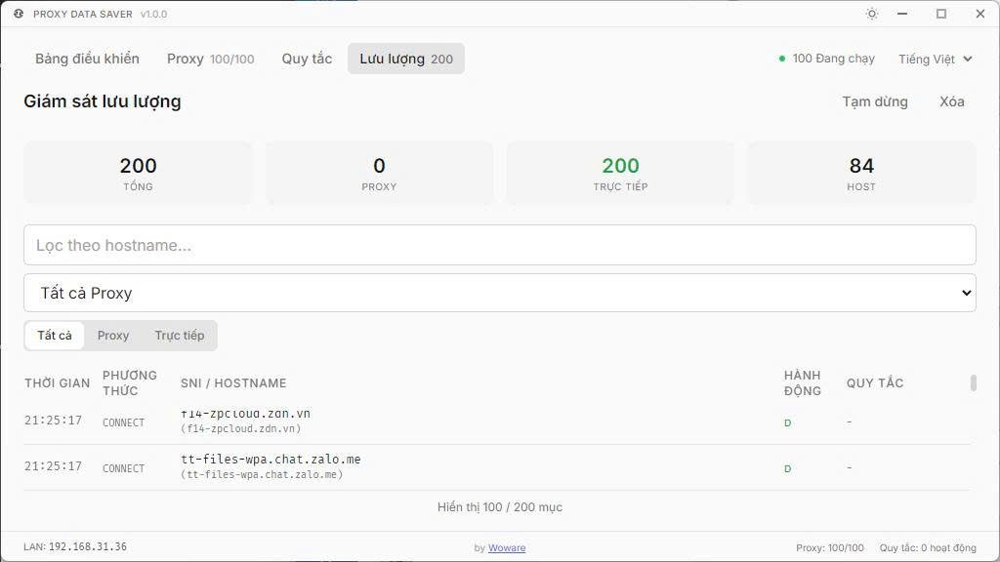

# Proxy Data Saver



**Proxy Data Saver** là ứng dụng Windows giúp bạn tiết kiệm data di động (4G/5G) bằng cách điều hướng thông minh - chỉ những traffic cần thiết mới đi qua proxy, còn lại đi trực tiếp qua mạng local.

## Tải xuống

**[Tải Proxy Data Saver tại đây](https://app.woware.net/items/proxy-data-saver/4)**

---

## Screenshots

| Dashboard | Cấu hình Proxy |
|:---------:|:--------------:|
|  |  |

| Quản lý Rules | Traffic Monitor |
|:-------------:|:---------------:|
|  |  |

---

## Tại sao cần Proxy Data Saver?

Khi bạn dùng proxy (VPN, HTTP proxy), **toàn bộ traffic** của bạn sẽ đi qua proxy - kể cả những website không cần proxy như Google, YouTube, hay các dịch vụ trong nước. Điều này gây:

- **Lãng phí data**: Proxy thường tính tiền theo lưu lượng
- **Tốc độ chậm**: Traffic đi vòng qua server proxy xa
- **Không cần thiết**: Nhiều website hoạt động tốt mà không cần proxy

**Proxy Data Saver** giải quyết vấn đề này bằng cách cho phép bạn **tự định nghĩa** traffic nào đi qua proxy, traffic nào đi trực tiếp.

---

## Tính năng chính

### Conditional Routing
Tự động điều hướng traffic dựa trên rules bạn định nghĩa:
- Request A → đi qua proxy (ví dụ: Facebook, Netflix)
- Request B → đi trực tiếp (ví dụ: Google, YouTube)

### SNI Extraction
Tự động nhận diện tên miền thực từ HTTPS traffic (TLS ClientHello) để matching chính xác, không cần dựa vào IP.

### Multi-Proxy Support
Hỗ trợ nhiều proxy cùng lúc - mỗi proxy được gán một port riêng (8080, 8081, 8082...).

### Rule-based Matching
Sử dụng wildcard pattern để match domain:
- `*.facebook.com` - match `www.facebook.com`, `m.facebook.com`
- `*.google.com, *.youtube.com` - match nhiều pattern

### LAN Access
Cho phép các thiết bị khác trong mạng LAN (điện thoại, laptop) kết nối qua proxy của bạn.

### Traffic Monitor & Statistics
- Theo dõi real-time tất cả request đi qua proxy
- Thống kê chi tiết: tổng data, data qua proxy, data đi trực tiếp
- Biểu đồ trực quan theo ngày/tuần/tháng

---

## Hướng dẫn sử dụng

### Bước 1: Cấu hình Proxy

Nhập proxy của bạn vào ô **Proxy List** theo format:

```
username:password:host:port
```

Hoặc nếu proxy không có xác thực:

```
host:port
```

*Có thể nhập nhiều proxy, mỗi proxy một dòng.*

### Bước 2: Tạo Rules

Rules quyết định traffic nào đi qua proxy, traffic nào đi trực tiếp.

**Cú pháp Pattern:**
| Pattern | Mô tả |
|---------|-------|
| `*` | Match tất cả |
| `*.facebook.com` | Match `www.facebook.com`, `m.facebook.com`, ... |
| `*.local, localhost` | Match nhiều pattern (phân cách bằng dấu phẩy) |

**Ví dụ cấu hình Rules:**

| Pattern | Action | Giải thích |
|---------|--------|------------|
| `*.facebook.com, *.fbcdn.net` | Proxy | Facebook đi qua proxy |
| `*.google.com, *.youtube.com` | Direct | Google, YouTube đi trực tiếp |
| `*` | Direct | Mặc định đi trực tiếp |

### Bước 3: Kết nối thiết bị

Cấu hình HTTP Proxy trên browser hoặc thiết bị:

- **Host**: IP máy chạy app (hoặc `localhost` nếu dùng trên cùng máy)
- **Port**: Port hiển thị trong app (mặc định `8080`)

---

## Yêu cầu hệ thống

- **OS**: Windows 10/11
- **Windows Firewall**: Cho phép app khi được hỏi (để thiết bị LAN kết nối được)

---

## Lưu ý quan trọng

### Windows Firewall
Khi khởi động lần đầu, Windows sẽ hỏi cho phép app truy cập mạng. Bạn cần **Allow** để:
- Các thiết bị trong LAN có thể kết nối
- Proxy server hoạt động đúng

### Certificate Pinning
Một số ứng dụng có certificate pinning (ngân hàng, ví điện tử) sẽ **không hoạt động** qua proxy - đây là cơ chế bảo mật, không phải lỗi của app.

### Port Conflicts
Nếu port 8080 đã được sử dụng bởi ứng dụng khác (Docker, XAMPP...), hãy đổi **Start Port** trong phần cấu hình.

---

## Build từ source (dành cho developers)

```bash
# Clone repo
git clone https://github.com/user/proxy-data-saver.git
cd proxy-data-saver

# Cài dependencies
npm install

# Chạy development mode
npm run dev

# Build production (Windows)
npm run build:win
```

---

## Tech Stack

| Component | Technology |
|-----------|------------|
| Desktop Framework | Electron + electron-vite |
| Frontend | React + TypeScript + TailwindCSS |
| Proxy Server | Custom implementation với SNI extraction |
| Pattern Matching | wildcard-match |
| Storage | electron-store |
| i18n | Vietnamese / English |

---

## Hỗ trợ

Nếu gặp vấn đề khi sử dụng, vui lòng liên hệ qua:
- Website: [https://app.woware.net](https://app.woware.net)

---

## License

MIT License

---

**Made with by [Woware](https://app.woware.net)**
