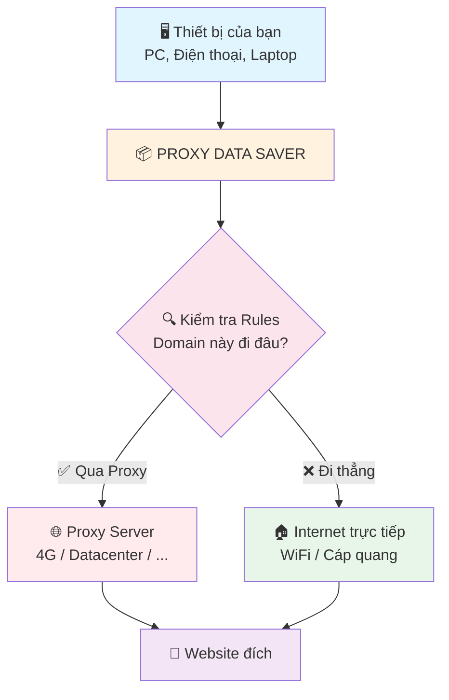
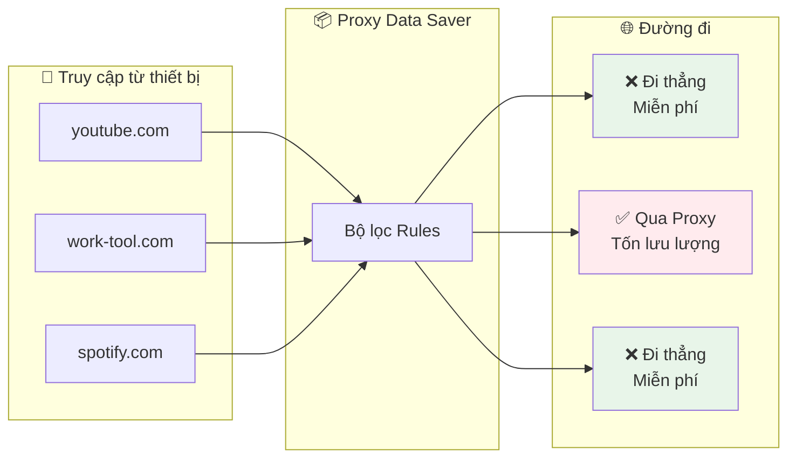
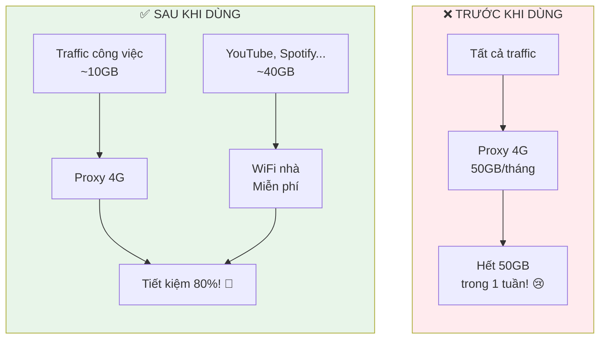
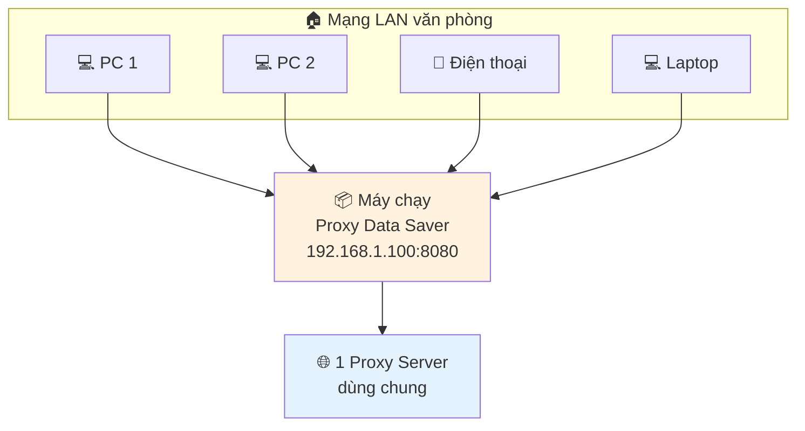

# Sơ đồ hoạt động Proxy Data Saver

## Sơ đồ 1: Luồng hoạt động chính

## Sơ đồ 2: Ví dụ cụ thể

## Sơ đồ 3: So sánh Trước vs Sau

## Sơ đồ 4: Chia sẻ LAN

---

## Hướng dẫn render

1. **Mermaid Live Editor**: https://mermaid.live - Paste code vào và export PNG/SVG
2. **VS Code**: Cài extension "Markdown Preview Mermaid Support"
3. **GitHub**: Tự động render khi xem file .md

## Gợi ý sử dụng

- **Sơ đồ 1**: Dùng cho phần "Cách hoạt động" trong mô tả sản phẩm
- **Sơ đồ 2**: Dùng để minh họa ví dụ cụ thể
- **Sơ đồ 3**: Dùng để highlight lợi ích tiết kiệm
- **Sơ đồ 4**: Dùng cho tính năng chia sẻ LAN
